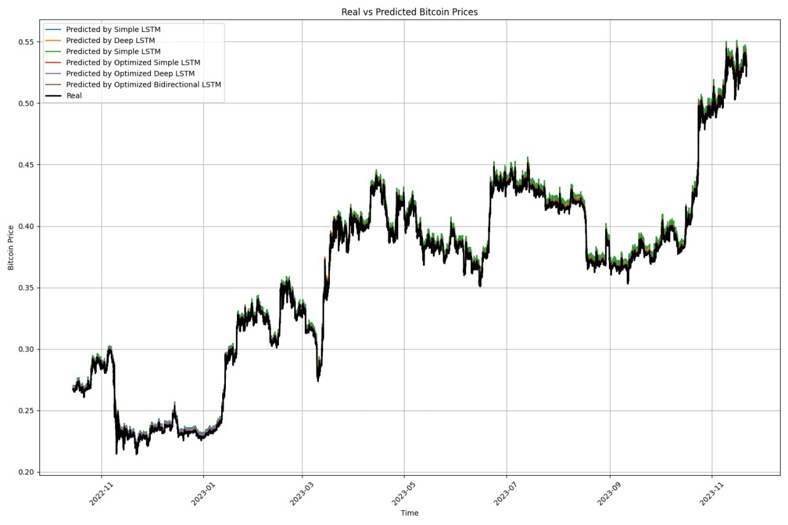

# Прогнозирование Цены Биткоина с использованием LSTM

## Описание проекта
Проект использует нейронные сети LSTM для прогнозирования цены Биткоина. Включает в себя скрипты для обработки данных, создания, обучения и сравнения моделей LSTM.

## Структура проекта
- `main.py`: Главный скрипт для запуска процесса обучения и тестирования.
- `components/`: Модули проекта, включающие функции для создания и обучения моделей.
- `data.json`: Данные для обработки и обучения моделей.
- `lstm_configs.json`: Конфигурационный файл для определения архитектуры моделей LSTM.

## Начало работы
### Требования
Для работы необходим Python 3.x и следующие библиотеки:
- NumPy
- Pandas
- TensorFlow
- Matplotlib

### Установка зависимостей

```pip install -r requirements.txt```

### Запуск проекта

```python main.py```


### Конфигурация моделей
Файл lstm_configs.json содержит различные конфигурации для экспериментов с LSTM сетями. Модифицируйте этот файл для тестирования различных архитектур сети.

### Тестирование моделей
После обучения моделей результаты тестирования сохраняются и могут быть визуализированы для сравнения производительности.

### Результаты тестирования:

